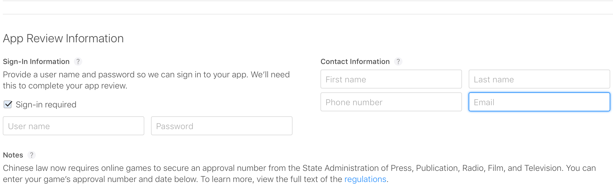

# Как протестировать мобильное приложение перед выгрузкой в апстор

**_Проверь дважды то, что проверено трижды!_**

## Окружение 
#### Помни! симулятор икскода не всегда дает справедливую картинку и правильное поведение кода!
Всегда следует проверять используя:
* 3g/4g networks
* wifi
* poor wifi
* wifi+ipv6+ipad 

```
 Можно поэтапно проверять все описанное выше.
 Если сломалось что-то одно, значит нужно зафиксировать проблему
 и всё равно провести все этапы проверки, что бы разработчик получил 
 полный список проблем и решил их одним скопом.
```

## Версия & Bilds
```
Всегда четко определите что вы тестируете.
 
Если новый функционал, которого еще нет в публичном доступе, 
значит версия приложение из аппстора вам не подойдет.
 
Если жалоба на уже выложеное приложение, значит свежие билды бесполезны.
 
Если приложение собрано вами, смотрите чтобы код был актуален. 

Если приложение установлено, через фабрик обязательно проверяйте версию, которую ставите. 

Если вам собрали неправильную версию билда и дали тестировать, 
на первый раз спокойно сообщите об ошибке, на второй раз жестко намекните, 
на третий раз киньте стулом(шутка).
```

## Доступы
_Всегда! просто всегда! проверяйте на работоспособность аккаунт для логина, который вы предоставляете тестировщикам эпла для логина._ 

```
Если приложение требует авторизации, 
убедитесь что такой аккаунт существует, 
в противном случае следует бомбить менеджера в первую очередь, 
требуя создать такой аккаунт.
```

###### Такой аккаунт можно найти (или если он пустой, но должен быть, нужно заполнить) тут



#### Домен имеет значение
```
убедитесь, что домен ведет на нужный айпи! 
Используешь только айпи? убедитесь что это тот айпи. 
Верный айпи? убедитесь, что там указан верный порт!

Никогда!!! не пропускай приложение в стор, 
если у него нет домена с поддержкой айпив6.
```

## Суперзнания

* [Как настроить айпив6 сеть(сто пудов работает! если не работает учи английский)](https://developer.apple.com/library/archive/documentation/NetworkingInternetWeb/Conceptual/NetworkingOverview/UnderstandingandPreparingfortheIPv6Transition/UnderstandingandPreparingfortheIPv6Transition.html#//apple_ref/doc/uid/TP40010220-CH213-SW16)
* [Еще одна ссылка как настроить в6 сеть](https://stackoverflow.com/questions/37969860/how-to-test-ios-app-on-supporting-ipv6) 

### UDP:
```
to be continue
```